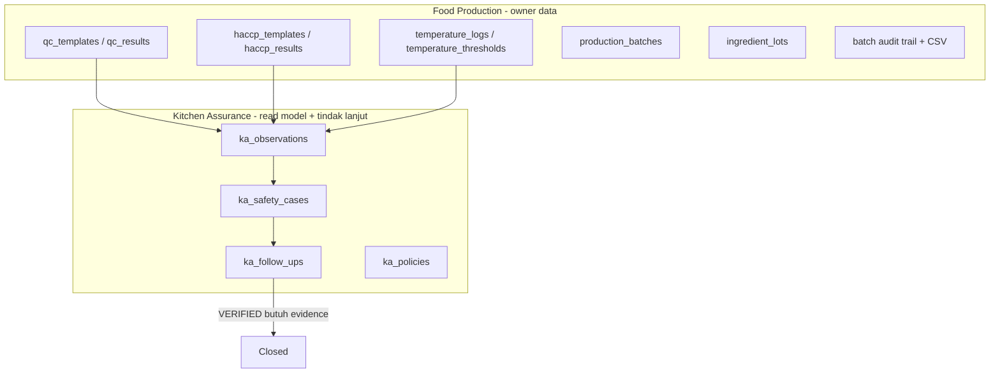
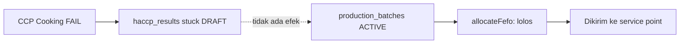

# Food Safety Module — Fit/Gap Assessment

**Status:** SUPERSEDED sebagian oleh [ADR-004](../adr/004-food-safety.md) — dokumen ini dipertahankan sebagai jejak analisis
**Tanggal:** 2026-08-10
**Revisi:** Koreksi setelah verifikasi lanjutan; keputusan final pindah ke ADR-004 — 2026-08-10
**Owner:** Inventory Domain / Product Architecture
**Sumber scope:** "Food Safety Module — Functional & Technical Scope — Final" (SCOPE LOCKED)
**Basis review:** codebase `inventory-app` + `sales` per 2026-08-10, ADR-001/002/003

> Dokumen ini menilai scope Food Safety terhadap kondisi codebase **saat ini**. Keputusan arsitektur final sudah dikunci di [ADR-004](../adr/004-food-safety.md); bila ada perbedaan antara dokumen ini dan ADR-004, **ADR-004 yang berlaku**.

---

## 0. Koreksi setelah verifikasi lanjutan

Empat fakta diverifikasi ulang langsung ke kode setelah draft pertama. Semuanya mengubah kesimpulan:

1. **Batch sudah per finished good.** `production-results.ts` membuat satu batch per baris FG per result (`insertMany(batchDocs)`). Usulan "satu result = satu batch" dibatalkan — model existing justru yang benar karena memungkinkan HOLD selektif per menu.
2. **`qc_results` belum punya kaitan batch**, hanya `productionPlanId?`. QC tidak bisa memicu HOLD selektif tanpa penambahan `productionBatchId`. Ini naik menjadi P0, bukan P1.
3. **Kegagalan HACCP belum bisa dipersist sebagai hasil.** `HaccpResultStatus` tidak mengenal FAIL, dan `assertHaccpCanComplete()` justru memblokir dokumen yang gagal menjadi COMPLETED. Perlu sumbu `disposition` terpisah dari status workflow.
4. **Traceability tidak butuh ledger baru.** `material_requirements.lines[].sources[]` menyimpan atribusi per resep (`recipeId`, `qty`), sehingga rantai batch ke lot ke supplier dapat direkonstruksi secara proporsional. Traceability turun prioritas dari fondasi P1 menjadi kapabilitas audit readiness.

Konsekuensi urutan: **P0 hanya menjawab satu pertanyaan** — bisakah makanan yang diketahui gagal food-safety control tetap keluar dari dapur. Setelah P0, jawabannya harus tidak.

---

## 1. Ringkasan eksekutif

Scope Food Safety **sebagian besar sudah ada** di codebase, tersebar di dua domain: Food Production (FP) memiliki checklist/monitoring/evidence, Kitchen Assurance (KA) memiliki finding/corrective action/verification. Dari 20 entity MVP di scope, **11 sudah tersedia atau tinggal di-extend**, 6 benar-benar baru, dan 3 sebaiknya dicoret dari MVP.

Yang perlu dibangun baru justru bagian yang paling bernilai untuk audit BGN, yaitu **HACCP study** (hazard analysis, CCP determination, critical limit, monitoring plan) — hari ini sistem punya *checklist CCP* tapi tidak punya *dasar keputusan mengapa suatu step adalah CCP*. Untuk auditor, checklist tanpa hazard analysis adalah bukti yang menggantung.

Dua temuan kritis yang muncul di luar scope dokumen, dan menurut saya harus diselesaikan lebih dulu daripada entity baru mana pun:

**Temuan A — Batch yang gagal CCP masih bisa dikirim.** Status HOLD tidak ditegakkan di mana pun. Ini risiko keamanan pangan yang aktif, bukan sekadar gap fitur. Detail di bagian 4.

**Temuan B — Backward traceability ke supplier tidak bisa dijawab dalam satu query.** Datanya ada, tapi tersebar dan sebagian last-write-wins. Kalau auditor BGN bertanya "batch ini bahannya dari supplier mana", hari ini jawabannya manual. Detail di bagian 5.

Satu catatan arsitektur yang menentukan bentuk implementasi: **membuat "Food Safety" sebagai module keempat yang berdiri sendiri akan melanggar ADR-001 dan ADR-002**. Rekomendasi saya adalah Food Safety menjadi *lensa audit* di atas FP dan KA, bukan domain baru. Detail di bagian 3.

---

## 2. Apa yang sudah ada hari ini

Peta kepemilikan kapabilitas food safety saat ini:



Kolom "engine" yang relevan dan sudah berjalan:

- **Checklist engine (template + result + PASS/FAIL/NA + evidence foto).** Ada dua instance: QC ([lib/food-production/qc.ts](lib/food-production/qc.ts)) dan HACCP ([lib/food-production/haccp.ts](lib/food-production/haccp.ts)). Keduanya punya bentuk yang sama: `items[]` dengan `key/label/required`, hasil `PASS|FAIL|NA`, `note`, `evidenceUrls`, plus `summary` yang menghitung `requiredFailCount`.
- **Monitoring pengukuran.** `temperature_logs` mencatat `stage` (RECEIVING/COOKING/HOLDING), `suhuC`, dan `alertStatus` (OK/WARN/OUT_OF_RANGE/CRITICAL) yang dievaluasi terhadap `temperature_thresholds` saat write.
- **Finding → corrective action → verification.** `ka_safety_cases` (OPEN → IN_PROGRESS → PENDING_VERIFY → CLOSED) dan `ka_follow_ups` (OPEN → DONE → VERIFIED). Verifikasi sudah punya gate evidence yang benar:

```ts
// lib/kitchen-assurance/follow-up.ts:83
export function assertFollowUpCanVerify(doc: Pick<KaFollowUpDoc, 'evidenceMedia' | 'status'>): string | null {
  if (doc.status !== 'DONE') return 'Hanya status DONE yang bisa diverifikasi';
  if (!doc.evidenceMedia?.length) return 'Evidence wajib sebelum verifikasi';
  return null;
}
```

- **Lot & batch.** `ingredient_lots` (dari GRN) dan `production_batches` (dari production result), keduanya dengan expiry dan FEFO.
- **Batch audit trail.** Sudah menggabungkan event BATCH/PLAN/RESULT/TEMP_LOG/QC/HACCP/AUDIT dan bisa diekspor CSV.

Platform yang tinggal dipakai: multi-tenant scoping, RBAC, audit log, state-machine + `history[]` per dokumen ([lib/food-production/document.ts](lib/food-production/document.ts)), penomoran dokumen, dan media/evidence storage (`storeBase64Image`).

---

## 3. Konflik arsitektur yang harus diputuskan dulu

Scope menulis Food Safety sebagai module dengan tiga area (Prerequisite, HACCP, Assurance). Kalau diterjemahkan literal menjadi module baru, ada tiga benturan langsung dengan ADR yang sudah ACCEPTED.

**Benturan 1 — kepemilikan HACCP.** ADR-001 menetapkan QC, Cold Chain, dan HACCP dimiliki Food Production, dan Phase 5 sudah ditandai DONE termasuk HACCP evidence. Module Food Safety yang memiliki HaccpPlan sendiri akan memindahkan kepemilikan tanpa keputusan eksplisit.

**Benturan 2 — larangan duplikasi di KA.** ADR-002 menyatakan KA tidak memiliki QC/HACCP/Temperature/Food Safety Evidence, dan secara eksplisit menolak "Duplikasi Cold Chain / HACCP / WR ke dalam KA" serta "Jangan tambah menu Food Safety / Incident / Checklist".

**Benturan 3 — Checklist Engine KA berstatus frozen.** ADR-002 mencantumkan Checklist Engine, Policy Engine, dan Resolution sebagai *frozen*. Scope meminta "satu checklist engine untuk semua kebutuhan" — kalau itu diarahkan ke KA, artinya membuka yang dibekukan.

### Rekomendasi

**Food Safety bukan domain baru, melainkan lensa audit di atas FP dan KA.** Konkretnya:

- Data food safety tetap dimiliki FP (checklist, monitoring, batch, lot) dan KA (finding, corrective action, verification).
- Yang baru dan benar-benar milik "Food Safety" hanyalah **HACCP study** (plan, hazard analysis, CCP, critical limit, monitoring plan) dan **read-model audit readiness** (traceability view, evidence chain, dashboard).
- HACCP study ditempatkan di dalam Food Production sebagai perluasan `haccp_*` yang sudah ada, bukan koleksi paralel. Checklist engine yang dipakai adalah engine FP (`*_templates` + `*_results`), bukan membuka engine KA.
- Prerequisite checklist (hygiene, cleaning, pest control, dst.) menjadi **kategori baru di engine checklist FP**, bukan entity baru. Ini konsisten dengan prinsip Lean di scope §3.1.

Konsekuensinya: menu "Food Safety" boleh ada di UI sebagai satu pintu masuk audit, tapi di layer data ia adalah view/aggregation, bukan bounded context keempat. Rekomendasi ini sudah dikunci di [ADR-004](../adr/004-food-safety.md), yang sekaligus merevisi ADR-001 §Phase 5 dan mengklarifikasi ADR-002 §Frozen.

---

## 4. Temuan kritis A — HOLD tidak ditegakkan

Ini temuan terpenting dalam review ini.

Scope §30 dan §39 meminta status food safety per batch: `PENDING → IN_PROGRESS → PASS → RELEASED`, dan `FAIL → HOLD` sampai corrective action selesai. Hari ini **tidak ada satu pun mekanisme yang menahan batch**.

Buktinya berlapis:

**Pertama, status batch tidak punya HOLD.**

```ts
// lib/food-production/production-batch.ts:27
  status: 'ACTIVE' | 'EXPIRED' | 'CONSUMED';
```

**Kedua, FEFO mengalokasikan batch tanpa melihat hasil food safety sama sekali.** Kandidat batch diambil hanya berdasarkan status stok dan expiry:

```ts
// lib/food-production/fefo-consume.ts:66 — filter kandidat batch
    status: { $in: ['ACTIVE', 'EXPIRED'] },
```

Tidak ada join ke `haccp_results` maupun `qc_results` di jalur alokasi manapun (`fefo-allocate.ts`, `fefo-consume.ts`, `dist-fefo-ship.ts`, handler distribution).

**Ketiga, gate HACCP yang ada hanya mengunci dokumennya sendiri, bukan batch-nya.** `assertHaccpCanComplete` mencegah checklist berstatus COMPLETED bila ada CCP wajib yang FAIL:

```ts
// lib/food-production/haccp.ts:226 — assertHaccpCanComplete
    if (!item) return `CCP wajib "${t.label}" belum diisi`;
    if (item.result === 'FAIL') return `CCP wajib gagal: ${t.label}`;
    if (item.result === 'NA') return `CCP wajib "${t.label}" harus PASS/FAIL`;
```

Efek praktisnya justru berbahaya: ketika CCP gagal, dokumen HACCP **tertahan di DRAFT/SUBMITTED**, sementara batch-nya tetap `ACTIVE` dan tetap ikut FEFO. Batch yang gagal CCP jadi tidak terlihat gagal — ia hanya "belum selesai diisi".

**Keempat, `HOLD_BATCH` di KA hanya label.** `KaResolutionType` punya `HOLD_BATCH` dan `DISCARD_BATCH`, dan `KaSafetyCaseDoc` punya `inventoryHoldRef`. Pencarian ke seluruh repo menunjukkan `HOLD_BATCH` dan `DISCARD_BATCH` tidak pernah dibaca di luar deklarasi dan label UI-nya, sedangkan `inventoryHoldRef` hanya ditulis sekali di [lib/api/handlers/kitchen-assurance.ts](lib/api/handlers/kitchen-assurance.ts) baris 617 dan tidak pernah dikonsumsi.

### Skenario kegagalan hari ini



### Yang perlu dibangun

Ini pekerjaan kecil dengan dampak besar, dan sebaiknya dikerjakan lebih dulu daripada seluruh HACCP study:

1. Tambah `foodSafetyStatus: PENDING | IN_PROGRESS | PASS | HOLD | RELEASED` pada `production_batches` (field terpisah dari `status` stok, jangan dicampur).
2. Tambah filter di `fefo-consume.ts` agar batch `HOLD` tidak pernah menjadi kandidat, dengan pesan shortfall yang jelas ("batch ditahan karena CCP gagal") supaya operator tidak bingung stok hilang.
3. Sambungkan CCP FAIL → set `HOLD` + auto-create `ka_safety_cases` (mekanisme auto-issue sudah ada di [lib/kitchen-assurance/auto-issue.ts](lib/kitchen-assurance/auto-issue.ts) dan idempotent lewat `sourceKey`).
4. Sambungkan `ka_follow_ups` berstatus VERIFIED → izinkan transisi `HOLD → RELEASED`. Rantai release-nya jadi tertutup: gagal, ditahan, diperbaiki, diverifikasi, baru boleh keluar.

---

## 5. Temuan kritis B — traceability

Kabar baiknya: **datanya sudah lengkap, tidak perlu capture baru.** Rantai backward bisa direkonstruksi lewat:

`production_batches.productionPlanId` → `material_issues` (by `productionPlanId`) → `fefoConsume[].allocations[]` → `ingredient_lots` → `grnId` → GRN → supplier.

`material_issues` memang mempersistensi alokasi lot per baris:

```ts
// lib/food-production/material-issue.ts:47
  /** W2-6: FEFO consume summary per line (ingredient_lots). */
  fefoConsume?: Array<{
    stokId: string;
    warehouseKode: string;
    needQty: number;
    allocated: number;
    shortfall: number;
    skippedNoLots: boolean;
    allocations?: unknown[];
  }>;
```

Masalah atribusi "lot mana masuk batch mana" ternyata **sudah terjawab oleh data existing**. `material_requirements` menyimpan rincian per resep untuk setiap bahan:

```ts
// lib/food-production/material-requirement.ts:92
export interface MrpSourceRef {
  menuId?: string;
  menuKode?: string;
  recipeId: string;
  recipeKode?: string;
  qty: number;
}
```

Karena batch membawa `finishedGoodProductId` dan `productionPlanId`, dan `sources[]` merinci resep mana meminta berapa banyak dari tiap bahan, atribusi proporsional bisa dihitung — termasuk untuk bahan yang dipakai beberapa resep sekaligus. Tidak perlu ledger baru, tidak perlu mengubah `material_issues`.

Yang tersisa hanya tiga hal kecil:

1. **`lastConsumedBy` bersifat last-write-wins.** Di `ingredient_lots` maupun `production_batches`, field ini menyimpan konsumen terakhir saja, bukan ledger. Dilarang dipakai sebagai sumber traceability.
2. **Supplier butuh hop tambahan.** `IngredientLotDoc` menyimpan `grnId`/`noGRN` tapi tidak `supplierId`. Cukup denormalisasi `supplierId` saat GRN post; nama supplier tetap diambil dari master, bukan disimpan sebagai field otoritatif.
3. **Batch audit trail belum mencakup lot dan distribusi.** `BatchTrailEventType` saat ini hanya `BATCH | PLAN | RESULT | TEMP_LOG | QC | HACCP | AUDIT`.

Rekomendasi: `FoodSafetyTraceability` dibangun sebagai **read-model query**, bukan koleksi baru (konsisten dengan scope §24). Hasilnya wajib dilabeli apa adanya:

> Traceability attribution is a candidate-lot inference based on recorded material allocation, not a physical observation.

Untuk recall, candidate **superset** adalah jawaban yang benar — lebih baik terlalu banyak kandidat lot daripada kehilangan satu. Sistem tidak berpura-pura memiliki presisi yang tidak dimilikinya.

---

## 6. Peta 20 entity scope terhadap codebase

Legenda verdict: **PAKAI** = ada dan cukup · **EXTEND** = ada, perlu tambahan field/logic · **BARU** = harus dibangun · **CORET** = keluarkan dari MVP.

### Prerequisite

| Entity scope | Existing | Verdict | Catatan |
|---|---|---|---|
| FoodSafetyProgram | — | **BARU** (ringan) | Cukup master kecil: kode, nama, frequency, responsibleRole. 11 nilai seed sudah didefinisikan di scope §5. |
| FoodSafetyRequirement | — | **BARU** (ringan) | Anak dari Program. Sekaligus jadi wadah BGN requirement mapping (§26) — jangan dibuat entity terpisah. |
| FoodSafetyChecklist | `qc_templates`, `haccp_templates` | **EXTEND** | Bentuk template sudah tepat (`items[]` + `required` + `needsPhoto`). Cukup tambah kategori prerequisite dan pointer `requirementId`. Jangan bikin engine ketiga. |
| FoodSafetyChecklistRecord | `qc_results` | **EXTEND** | Sudah punya PASS/FAIL/NA, note, evidenceUrls, summary, state machine, history. Tambah `programId`, `checklistPeriod`, dan pemicu finding otomatis saat FAIL. |

### HACCP

| Entity scope | Existing | Verdict | Catatan |
|---|---|---|---|
| HaccpPlan | — | **BARU** | Container study. Lifecycle DRAFT → UNDER_REVIEW → APPROVED → ACTIVE → SUPERSEDED; framework state machine FP sudah bisa dipakai ulang. |
| HaccpPlanVersion | — | **CORET** | Versioning inline di `HaccpPlan` (`version`, `effectiveDate`, `supersededById`) dengan unique partial index pada plan aktif. Entity terpisah baru bernilai kalau ada perbandingan antar versi. |
| HaccpProduct | `recipes`, `menus` | **CORET** | Plan menyimpan `recipeIds[]` dan `menuIds[]` langsung. Layer mapping perantara tidak memberi manfaat apa pun di MVP. |
| HaccpProcessStep | — | **BARU, embedded** | `recipes` tidak punya konsep tahapan proses sama sekali (diverifikasi: tidak ada field step/tahapan). Disimpan sebagai `processSteps[]` di dalam `HaccpPlan`, bukan collection — belum ada kebutuhan reuse antar-plan, versioning independen, maupun analitik lintas plan. |
| HaccpHazardAnalysis | — | **BARU** | Inti HACCP dan gap terbesar hari ini. Wajib menyimpan alasan keputusan CCP (scope §12). |
| HaccpCCP | `haccp_templates.category` | **BARU, embedded** | Kategori CCP_COOK/COOL/HOLD/RECEIVE/DIST sudah ada. Yang belum: CCP sebagai *hasil* hazard analysis, bukan template yang dibuat manual. Disimpan sebagai `ccps[]` di `HaccpPlan`. Tanpa workflow/approval/risk-scoring engine. |
| HaccpMonitoringPlan | `haccp_templates.items`, `temperature_thresholds` | **BARU, embedded** | `criticalLimitNote` hari ini hanya string bebas (`'≥ 74°C'`). Menjadi terstruktur (parameter, operator, value, unit, duration) plus monitoring plan ringan (method, frequency, responsibleRole). Bukan scheduler engine. |
| HaccpMonitoringRecord | `haccp_results`, `temperature_logs` | **EXTEND** | Sudah ada per batch. Yang kurang: `operatorId`, `measuredValue` yang dievaluasi otomatis terhadap critical limit (sekarang operator sendiri yang mengetik PASS/FAIL), dan `instrumentId` yang sengaja dibiarkan opsional karena master kalibrasi belum matang. |
| HaccpVerification | `ka_follow_ups` (VERIFIED) | **EXTEND** | Verifikasi corrective action sudah ada dan bergate evidence. Yang belum: verifikasi periodik atas *plan* dan atas *kelengkapan record*. |

### Assurance

| Entity scope | Existing | Verdict | Catatan |
|---|---|---|---|
| FoodSafetyFinding | `ka_safety_cases` | **PAKAI** | Cocok hampir 1:1. `caseKind: NONCONFORMANCE`, severity, status, `batchId`, `sourceKey` idempoten. Yang kurang hanya `responsiblePerson` dan `dueDate` di level case (sekarang ada di follow-up). |
| FoodSafetyCorrectiveAction | `ka_follow_ups` | **PAKAI** | Cocok 1:1: action, owner, dueAt, evidenceMedia, verifiedAt/By. Tidak perlu entity baru. |
| FoodSafetyEvidence | media storage + `evidenceUrls`/`evidenceMedia` | **PAKAI** | Evidence sudah melekat pada checklist, monitoring, case, dan follow-up. Membuat koleksi evidence terpusat justru menambah duplikasi tanpa manfaat audit. |
| FoodSafetyTraceability | `material_issues`, `ingredient_lots`, `production_batches`, batch trail | **EXTEND** (read-model) | Lihat bagian 5. Bukan koleksi baru. |

### Optional

| Entity scope | Existing | Verdict | Catatan |
|---|---|---|---|
| FoodSafetyTrainingRecord | `users` saja | **CORET dari MVP** | Tidak ada master karyawan; `users` adalah identitas aplikasi tanpa atribut food handler. Membangun ini berarti membuka HR-lite. Tunda. |
| FoodSafetySupplierCheck | supplier di `sales` | **CORET dari MVP** | Supplier dimiliki `sales`. Lintas aplikasi, biaya integrasi tidak sebanding untuk MVP. |
| FoodSafetyInstrumentCheck | `assets`, `maintenance_schedules` | **CORET dari MVP** | Sudah ada master aset dan jadwal maintenance. Cukup rujuk `instrumentId` dari monitoring record; validasi kalibrasi menyusul. |

Ringkasan hitungan setelah koreksi: **3 PAKAI · 7 EXTEND · 5 BARU (3 di antaranya embedded) · 5 CORET**.

Dibanding draft pertama, `HaccpProduct` dan `HaccpPlanVersion` pindah ke CORET, sementara process step, CCP, dan monitoring plan menjadi struktur embedded di `HaccpPlan` alih-alih collection tersendiri. `HaccpHazardAnalysis` tetap entity baru yang wajib — justru itulah yang membedakan HACCP study dari sekadar checklist CCP.

---

## 7. Yang sebaiknya dikurangi dari scope

Selain 3 entity optional di atas, ada beberapa hal dalam scope yang menurut saya menambah biaya tanpa menambah kesiapan audit:

- **Checklist engine generik yang benar-benar baru.** Scope §7 meminta satu engine untuk semua kebutuhan. Di codebase sudah ada dua engine dengan bentuk identik (QC dan HACCP). Menyatukan keduanya adalah refactor berisiko pada modul yang sudah live. Rekomendasi: pakai engine QC untuk prerequisite, biarkan HACCP tetap terpisah karena ia akan tumbuh ke arah yang berbeda (critical limit terstruktur, monitoring plan).
- **`HaccpPlanVersion` sebagai entity terpisah.** Untuk MVP, versioning cukup sebagai field `version` + `supersededById` di dalam `HaccpPlan`. Entity terpisah baru bernilai kalau ada perbandingan antar versi.
- **Dashboard empat kuadran penuh (scope §36).** KA sudah punya dashboard exception-driven dan `attention.ts` yang membaca `haccp_results`. Tambahkan panel audit readiness ke sana dulu; dashboard Food Safety mandiri baru dibuat setelah datanya terbukti terisi.
- **BGN requirement mapping sebagai struktur terpisah (§26).** Lebur ke `FoodSafetyRequirement` dengan field `source: BGN | INTERNAL`. Satu entity, dua kegunaan.

---

## 8. Rencana bertahap dan estimasi effort

Estimasi dalam hari-orang (dev-day), mencakup model + API handler + UI + unit test, dengan basis kalibrasi: modul HACCP existing (`haccp.ts` 318 baris + handler + halaman UI) setara sekitar 5–6 dev-day, dan KA Cases+FollowUp setara sekitar 10–12 dev-day.

Urutan sengaja dibalik dari scope §45: **penegakan HOLD didahulukan**, karena itu satu-satunya bagian yang menutup risiko nyata dan justru paling murah. Traceability turun dari fondasi menjadi kapabilitas audit readiness setelah terbukti dapat direkonstruksi dari data existing.

### Fase 0 — ADR-004 (selesai)

Keputusan arsitektur dikunci di [ADR-004](../adr/004-food-safety.md), CONTEXT-MAP dan REGISTER diperbarui.

### Fase 1 — P0 Safety Gate (prioritas tertinggi)

Menjawab satu pertanyaan: bisakah makanan yang diketahui gagal food-safety control tetap keluar dari dapur.

- **1A** `foodSafetyStatus` + `foodSafetyHistory[]` pada `production_batches`, dengan backfill `PENDING` bermode dry-run.
- **1B** `disposition` pada `haccp_results`, terpisah dari status workflow; cabut baris FAIL dari `assertHaccpCanComplete()` sambil mempertahankan gate kelengkapan NA dan `needsPhoto`.
- **Flags** pisahkan `required` / `critical` / `holdOnFail`, dengan normalizer yang menegakkan invarian dan memaksa CCP menjadi derived true.
- **1C** kegagalan HACCP menahan batch **saat disimpan**, bukan saat COMPLETED.
- **1D** temperature log stage COOKING/HOLDING menahan batch lewat `productionBatchId` yang sudah ada.
- **1E** `productionBatchId` pada `qc_results` + pemilih batch di UI QC.
- **1F** QC critical FAIL menahan batch; tanpa batch anchor, jadi proposed hold yang dikonfirmasi supervisor.
- **1G** gate HOLD di FEFO allocate/consume dan dist ship, di belakang flag per tenant.
- **Release** follow-up VERIFIED membuka `HOLD → RELEASED`, hanya untuk `FP_MANAGE_ROLES`.
- **Tests** regresi dan idempotency.
- **Estimasi: 7–10 dev-day.** Naik dari perkiraan awal karena 1E dan 1F (QC batch anchor) masuk ke P0.

### Fase 2 — Prerequisite

- `FoodSafetyProgram` + `FoodSafetyRequirement` (master ringan, `source: BGN | INTERNAL`, seed 11 program dari scope §5).
- Extend engine checklist QC: kategori prerequisite, `requirementId`, periode, auto-finding saat FAIL.
- **Status implementasi (2026-08-12):** DONE di codebase — API `/food-safety-programs` (+ compliance), QC `PREREQUISITE`, blast-radius proposed-hold, UI Prerequisite.
- **Estimasi: 6–9 dev-day.**

### Fase 3 — HACCP study

- `HaccpPlan` dengan `recipeIds[]`, `menuIds[]`, dan `processSteps[]`, `hazards[]`, `ccps[]`, `criticalLimits[]`, `monitoringPlans[]` sebagai struktur embedded.
- Critical limit terstruktur menggantikan `criticalLimitNote` string bebas, dengan skrip migrasi bermode dry-run.
- **Status implementasi (2026-08-12):** DONE di codebase — model + API `/haccp-plans` (+ seed-example + status gate), indexes (termasuk unique partial satu ACTIVE/tenant), migrasi dry-run `migrate-haccp-critical-limits.mjs`, UI HACCP Study (list/create/edit/status/seed), sandbox purge, tests Fase 3. Konten operasional tetap bergantung validasi ahli (contoh berlabel `isExample`).
- **Estimasi: 10–15 dev-day.** Turun dari perkiraan awal karena `HaccpProduct`, `HaccpPlanVersion`, dan collection process step dicoret. Tetap bagian terbesar, dan paling bergantung pada input ahli keamanan pangan.

### Fase 4 — HACCP runtime

- `measuredValue` dan `operatorId` (dengan `instrumentId` opsional) dievaluasi otomatis terhadap critical limit, menggantikan operator yang mengetik PASS sendiri.
- Limit `TEXT` / catatan SOP tetap manual PASS/FAIL; kalibrasi instrumen tidak divalidasi di MVP (`instrumentId` hanya referensi).
- **Status implementasi (2026-08-12):** DONE 100% — eval engine + normalize create/update, seed template dengan `criticalLimit` terstruktur pada CCP numerik, UI nilai terukur + instrumen opsional (manual disabled hanya untuk limit numerik), tests operator/GT-LT-EQ/TEXT/HOLD.
- **Estimasi: 4–6 dev-day.**

### Fase 5 — Verifikasi sistem HACCP

- Record verifikasi ringan (`verificationType`, `verifiedBy`, `method`, `result`, evidence), terpisah dari verifikasi corrective action milik KA. Bukan engine.
- **Status implementasi (2026-08-12):** DONE di codebase — model `haccp_verifications`, API `/haccp-verifications`, gate PASS+evidence, UI HACCP Verify, indexes, sandbox purge, tests Fase 5. Tipe: PLAN | RECORD_COMPLETENESS | CCP_MONITORING.
- **Estimasi: 2–4 dev-day.**

### Fase 6 — Audit readiness

- BGN requirement mapping, agregasi evidence, status `NOT_READY | PARTIAL | READY`.
- Traceability read-model backward dan forward berlabel candidate-lot inference, denormalisasi `supplierId` ke `ingredient_lots`, perluasan `BatchTrailEventType` dengan `LOT` dan `DIST`.
- **Status implementasi (2026-08-12):** DONE 100% — `/food-safety-readiness` + `/food-safety-traceability`, UI Audit Readiness + panel di KA dashboard, GRN stamp + migrasi dry-run `supplierId`, trail LOT/DIST, indexes (termasuk lot/batch alloc), proportional `weightShare` via recipe↔FG (qty tetap superset), tests Fase 6. Attribution selalu dilabeli candidate-lot inference (bukan observasi fisik).
- **Estimasi: 8–12 dev-day.**

**Total MVP: sekitar 37–56 dev-day** di luar review dan UAT. Angka ini belum boleh dijadikan komitmen: Fase 3 bergantung pada ketersediaan konten HACCP yang disahkan, bukan pada kecepatan coding.

---

## 9. Risiko

- **Fase 3 macet karena konten, bukan kode.** Hazard analysis butuh keputusan ahli. Kalau kontennya belum siap, Fase 1 dan 2 tetap bisa memberi nilai audit sendiri — jangan digandeng.
- **Migrasi `criticalLimitNote` → critical limit terstruktur** menyentuh template HACCP yang sudah dipakai di produksi. Perlu skrip migrasi dengan mode dry-run, mengikuti pola skrip repair yang sudah ada.
- **Filter HOLD di FEFO berpotensi memunculkan shortfall mendadak** di dapur yang sedang berjalan. Perlu rollout dengan flag per tenant dan pesan error yang menjelaskan sebabnya.
- **Menu "Food Safety" berisiko dibaca sebagai domain baru** oleh tim lain kalau ADR-004 tidak eksplisit menyatakan ia adalah lensa, bukan bounded context.

---

## 10. Keputusan yang sudah diambil

Seluruhnya dikunci di [ADR-004](../adr/004-food-safety.md):

1. Food Safety adalah lensa audit dan kontrol disposisi di atas Food Production + Kitchen Assurance, bukan bounded context keempat.
2. Production Batch adalah unit disposisi food safety; satu batch per finished good per result dipertahankan.
3. Penegakan HOLD didahulukan di atas urutan scope §45, dan HOLD dipicu saat kegagalan disimpan, bukan saat pemeriksaan selesai.
4. `holdOnFail` menyiratkan `critical`; pada CCP keduanya derived dan tidak dapat dimatikan.
5. Auto-hold hanya untuk kegagalan yang terikat batch; kegagalan yang terikat lingkungan menjadi usulan yang dikonfirmasi supervisor.
6. Dicoret dari MVP: Training Record, Supplier Check, Instrument Check, `HaccpProduct`, `HaccpPlanVersion`, checklist engine generik baru, dan dashboard Food Safety mandiri.
7. Traceability memakai data existing dengan atribusi proporsional, dilabeli sebagai candidate-lot inference.

Satu hal yang tetap di luar kendali teknis: **penyedia konten hazard analysis dan critical limit untuk Fase 3**. Aplikasi hanya menyimpan keputusan yang telah disahkan pihak berkompeten; developer tidak menetapkan batas keamanan pangan.
